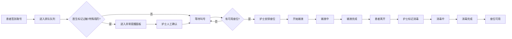

## 1. 产品概述

门诊输液排队系统是为医院输液室设计的前端应用，解决护士、医生、患者三方对输液队列、座位状态和异常情况的实时查看与管理需求。系统支持护士维护座位与消毒状态、医生标记特殊用药与过敏风险、患者查看排队状态，通过队列、座位图和异常提醒的联动，提升输液室运营效率和患者安全。

## 2. 核心功能

### 2.1 用户角色

| 角色 | 登录方式 | 核心权限 |
|------|----------|----------|
| 护士 | 角色切换 | 管理座位状态、执行消毒、安排患者入座、处理异常提醒 |
| 医生 | 角色切换 | 标记患者过敏风险、特殊用药、查看输液状态 |
| 患者 | 角色切换 | 查看个人排队号、预计等待时间、座位分配状态 |

### 2.2 功能模块

1. **主控制面板**: 角色切换、统计概览（排队中/输液中/消毒中座位数）
2. **队列管理**: 排队列表展示、患者状态流转、叫号功能
3. **座位图可视化**: 座位状态地图、消毒状态标记、座位分配操作
4. **异常提醒面板**: 过敏风险提醒、特殊用药提醒、需要人工确认的患者列表
5. **患者详情卡**: 展示患者基本信息、用药信息、过敏史、输液状态

### 2.3 页面详情

| 页面名称 | 模块名称 | 功能描述 |
|----------|----------|----------|
| 主控制台 | 角色切换栏 | 护士/医生/患者三种视图一键切换，不同角色显示不同操作权限 |
| 主控制台 | 统计概览区 | 实时显示当前排队人数、输液中人数、可用座位数、消毒中座位数 |
| 主控制台 | 队列列表区 | 按优先级展示排队患者，显示排队号、姓名、状态、预计等待时间 |
| 主控制台 | 座位图区 | 网格化展示所有座位，不同颜色区分状态（可用/占用/消毒/维修） |
| 主控制台 | 异常提醒区 | 醒目标记过敏患者、特殊用药患者，需护士人工确认后才能安排 |
| 患者详情弹窗 | 信息展示 | 展示患者基本信息、用药处方、过敏史、输液进度 |
| 患者详情弹窗 | 医生操作 | 医生可标记/取消过敏风险、特殊用药备注 |
| 患者详情弹窗 | 护士操作 | 护士可安排座位、开始输液、完成输液、标记消毒 |

## 3. 核心流程

### 3.1 患者排队输液流程

### 3.2 业务规则约束

1. **过敏标记患者**: 必须先由护士人工确认后才能安排座位
2. **消毒中的座位**: 不能安排给新患者，消毒完成后自动解锁
3. **已开始输液**: 不能取消排队，只能完成或中止输液
4. **状态联动**: 座位状态变化自动更新队列和统计数据，异常状态实时触发提醒

## 4. 用户界面设计

### 4.1 设计风格

- **主色调**: 医疗蓝 (#165DFF) 作为主色，代表专业和信任
- **辅助色**: 绿色 (#00B42A) 表示正常可用，红色 (#F53F3F) 表示异常/过敏，橙色 (#FF7D00) 表示消毒中/等待中
- **中性色**: 深灰 (#1D2129) 文字、浅灰 (#F2F3F5) 背景、白色 (#FFFFFF) 卡片
- **按钮风格**: 圆角 8px，微阴影，hover 状态有轻微缩放和加深
- **字体**: 使用思源黑体 (Source Han Sans) 或系统无衬线字体，保证中文可读性
- **布局风格**: 卡片式布局，清晰的功能分区，充足留白，信息层级分明
- **图标风格**: 使用线性图标，简洁明了，颜色与功能状态对应

### 4.2 页面设计概述

| 页面名称 | 模块名称 | UI 元素 |
|----------|----------|----------|
| 主控制台 | 角色切换栏 | 顶部横向排列，选中角色有蓝色下划线和高亮背景，切换时平滑过渡 |
| 主控制台 | 统计概览区 | 四个数据卡片横向排列，数字大号加粗，状态小圆点颜色区分 |
| 主控制台 | 队列列表区 | 左侧竖向列表，每行显示排队号、姓名、状态标签、预计时间，hover 高亮 |
| 主控制台 | 座位图区 | 中间网格布局，座位为圆角方块，点击有波纹效果，状态颜色区分明显 |
| 主控制台 | 异常提醒区 | 右侧面板，红色边框突出，异常项有闪烁动画提醒 |
| 患者详情弹窗 | 信息展示 | 遮罩层淡入，弹窗从底部滑入，信息分组展示，操作按钮在底部 |

### 4.3 响应式设计

- **桌面优先**: 针对医院工作站大屏幕优化，三栏布局（队列-座位图-提醒）
- **平板适配**: 中等屏幕下转为两栏布局，异常提醒面板可折叠
- **触控优化**: 按钮最小高度 44px，座位网格间距适中，适合触控操作
- **容器运行**: 页面可在 iframe 或其他容器中直接运行，无需特殊依赖

### 4.4 交互与动画

- **状态切换动画**: 座位状态变化时有 0.3s 的颜色过渡动画
- **异常提醒**: 高优先级异常有呼吸灯效果（透明度 0.5-1 循环）
- **叫号效果**: 当前叫号患者有高亮边框和轻微缩放动画
- **弹窗交互**: 点击遮罩层或关闭按钮可关闭，有平滑的滑入滑出效果
- **滚动优化**: 队列列表和提醒面板使用自定义滚动条，滚动流畅
