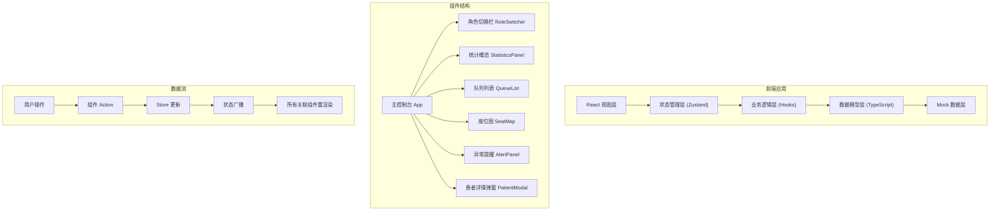
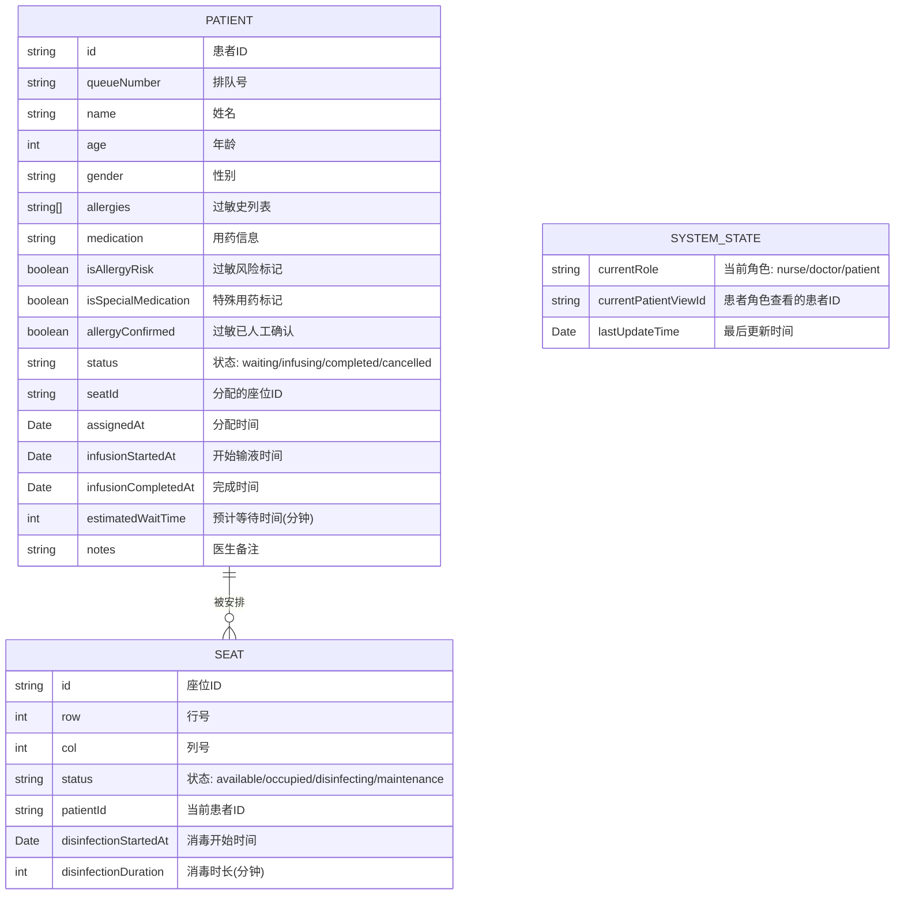

## 1. 架构设计



## 2. 技术描述

- **前端框架**: React 18 + TypeScript 5
- **构建工具**: Vite 5
- **样式方案**: Tailwind CSS 3
- **状态管理**: Zustand 4 (轻量级，适合本地状态管理)
- **图标库**: Lucide React (医疗相关图标丰富)
- **初始化工具**: vite-init
- **后端**: 无（纯前端应用，使用 Mock 数据）
- **数据存储**: 浏览器内存 + localStorage 持久化（可选）

## 3. 目录结构

```
src/
├── components/          # 组件目录
│   ├── RoleSwitcher.tsx     # 角色切换组件
│   ├── StatisticsPanel.tsx  # 统计概览面板
│   ├── QueueList.tsx        # 队列列表组件
│   ├── SeatMap.tsx          # 座位图组件
│   ├── AlertPanel.tsx       # 异常提醒面板
│   └── PatientModal.tsx     # 患者详情弹窗
├── store/               # 状态管理
│   └── useInfusionStore.ts  # 输液系统状态 store
├── types/               # TypeScript 类型定义
│   └── index.ts             # 患者、座位、枚举等类型
├── data/                # Mock 数据
│   └── mockData.ts          # 初始模拟数据
├── hooks/               # 自定义 Hooks
│   ├── usePatientActions.ts   # 患者操作逻辑
│   ├── useSeatActions.ts     # 座位操作逻辑
│   └── useBusinessRules.ts   # 业务规则校验
├── utils/               # 工具函数
│   └── formatters.ts        # 时间、状态格式化
├── App.tsx              # 主应用组件
├── main.tsx             # 入口文件
└── index.css            # 全局样式与 Tailwind 配置
```

## 4. 路由定义

| 路由 | 用途 |
|------|------|
| / | 主控制台（单页应用，无多路由） |

由于是单页面应用，不需要复杂的路由配置，使用 HashRouter 或 BrowserRouter 均可，为了容器内运行兼容性，推荐使用 HashRouter。

## 5. 数据模型

### 5.1 数据模型定义



### 5.2 核心枚举与类型定义

```typescript
// 角色类型
type UserRole = 'nurse' | 'doctor' | 'patient';

// 患者状态
type PatientStatus = 'waiting' | 'infusing' | 'completed' | 'cancelled';

// 座位状态
type SeatStatus = 'available' | 'occupied' | 'disinfecting' | 'maintenance';

// 患者接口
interface Patient {
  id: string;
  queueNumber: string;
  name: string;
  age: number;
  gender: '男' | '女';
  allergies: string[];
  medication: string;
  isAllergyRisk: boolean;
  isSpecialMedication: boolean;
  allergyConfirmed: boolean;
  status: PatientStatus;
  seatId: string | null;
  assignedAt: Date | null;
  infusionStartedAt: Date | null;
  infusionCompletedAt: Date | null;
  estimatedWaitTime: number;
  notes: string;
}

// 座位接口
interface Seat {
  id: string;
  row: number;
  col: number;
  status: SeatStatus;
  patientId: string | null;
  disinfectionStartedAt: Date | null;
  disinfectionDuration: number;
}

// 统计数据接口
interface Statistics {
  waitingCount: number;
  infusingCount: number;
  availableSeats: number;
  disinfectingSeats: number;
}
```

### 5.3 Mock 初始数据

```typescript
// 初始化 20 个座位 (4行 x 5列)
const initialSeats: Seat[] = Array.from({ length: 20 }, (_, i) => ({
  id: `S${String(i + 1).padStart(3, '0')}`,
  row: Math.floor(i / 5) + 1,
  col: (i % 5) + 1,
  status: i < 8 ? 'occupied' : i < 10 ? 'disinfecting' : 'available',
  patientId: i < 8 ? `P${String(i + 1).padStart(3, '0')}` : null,
  disinfectionStartedAt: i >= 8 && i < 10 ? new Date() : null,
  disinfectionDuration: 15,
}));

// 初始化排队患者
const initialPatients: Patient[] = [
  {
    id: 'P001',
    queueNumber: 'A001',
    name: '张三',
    age: 45,
    gender: '男',
    allergies: ['青霉素'],
    medication: '头孢曲松钠 2g',
    isAllergyRisk: true,
    isSpecialMedication: false,
    allergyConfirmed: false,
    status: 'waiting',
    seatId: null,
    assignedAt: null,
    infusionStartedAt: null,
    infusionCompletedAt: null,
    estimatedWaitTime: 15,
    notes: '',
  },
  // 更多患者数据...
];
```

## 6. 状态管理设计 (Zustand Store)

```typescript
interface InfusionState {
  // 数据
  patients: Patient[];
  seats: Seat[];
  currentRole: UserRole;
  currentPatientViewId: string | null;
  selectedPatientId: string | null;
  alertPatients: string[]; // 需要人工确认的患者ID列表
  
  // 计算属性
  getStatistics: () => Statistics;
  getWaitingPatients: () => Patient[];
  getInfusingPatients: () => Patient[];
  getAlertPatients: () => Patient[];
  
  // 角色操作
  setCurrentRole: (role: UserRole) => void;
  
  // 患者操作
  addPatient: (patient: Omit<Patient, 'id' | 'queueNumber'>) => void;
  updatePatient: (id: string, updates: Partial<Patient>) => void;
  confirmAllergy: (patientId: string) => void;
  markAllergyRisk: (patientId: string, isRisk: boolean) => void;
  markSpecialMedication: (patientId: string, isSpecial: boolean) => void;
  startInfusion: (patientId: string) => void;
  completeInfusion: (patientId: string) => void;
  cancelQueue: (patientId: string) => boolean; // 返回是否成功
  
  // 座位操作
  assignSeat: (patientId: string, seatId: string) => boolean; // 返回是否成功
  startDisinfection: (seatId: string) => void;
  completeDisinfection: (seatId: string) => void;
  setSeatMaintenance: (seatId: string, isMaintenance: boolean) => void;
  
  // 业务规则校验
  canAssignSeat: (patientId: string, seatId: string) => boolean;
  canCancelQueue: (patientId: string) => boolean;
}
```

## 7. 核心业务规则实现

### 7.1 过敏患者确认规则

```typescript
function canAssignSeat(patientId: string, seatId: string): boolean {
  const patient = patients.find(p => p.id === patientId);
  const seat = seats.find(s => s.id === seatId);
  
  if (!patient || !seat) return false;
  
  // 规则1: 过敏标记患者必须先人工确认
  if (patient.isAllergyRisk && !patient.allergyConfirmed) {
    return false;
  }
  
  // 规则2: 消毒中的座位不能安排
  if (seat.status === 'disinfecting' || seat.status === 'maintenance') {
    return false;
  }
  
  // 规则3: 座位已被占用
  if (seat.status === 'occupied') {
    return false;
  }
  
  return true;
}
```

### 7.2 输液开始后不能取消

```typescript
function canCancelQueue(patientId: string): boolean {
  const patient = patients.find(p => p.id === patientId);
  
  if (!patient) return false;
  
  // 规则: 已开始输液后不能取消排队
  if (patient.status === 'infusing' || patient.status === 'completed') {
    return false;
  }
  
  return true;
}
```

## 8. 组件联动机制

通过 Zustand 的订阅机制实现组件间联动：

1. **座位状态变化** → 自动更新统计数据、队列列表中的患者状态
2. **患者过敏标记** → 自动添加到异常提醒面板，触发视觉提醒
3. **输液开始** → 自动更新座位状态为占用，从排队列表移除
4. **消毒完成** → 自动将座位状态改为可用，通知队列可分配
5. **角色切换** → 自动控制各组件的操作按钮显隐和权限

## 9. 性能优化

- 使用 Zustand 的选择器 (selector) 避免不必要的重渲染
- 座位图组件使用 memo 包裹，只在座位数据变化时重绘
- 列表使用虚拟滚动（如排队患者超过 50 人时）
- 动画使用 CSS transition 而非 JavaScript 动画
- Mock 数据使用 Object.freeze 防止意外修改
